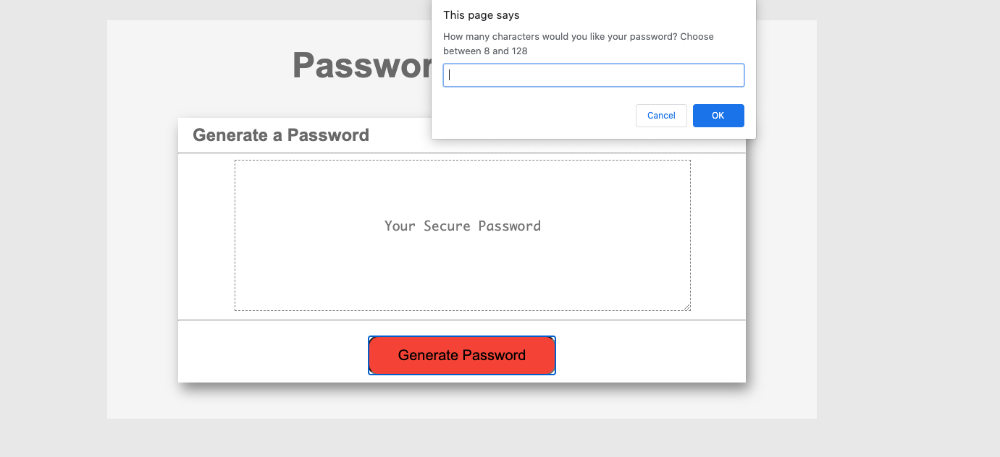
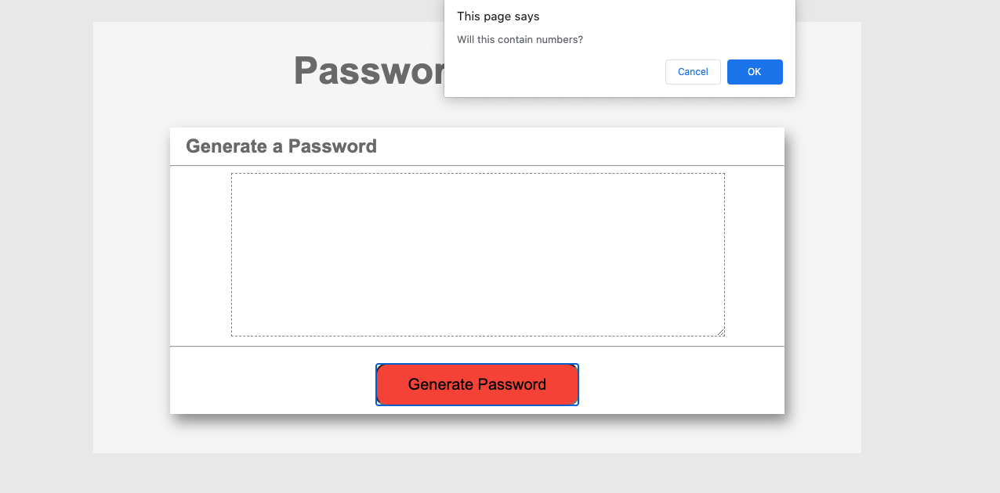
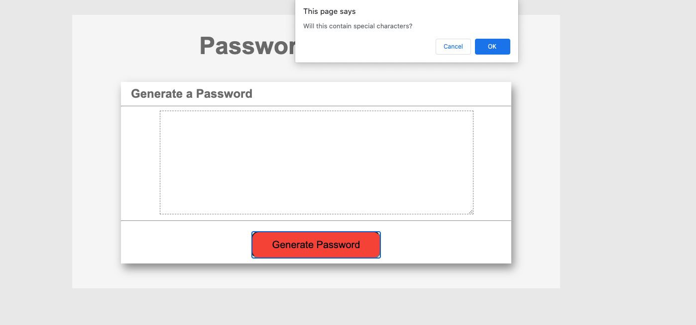
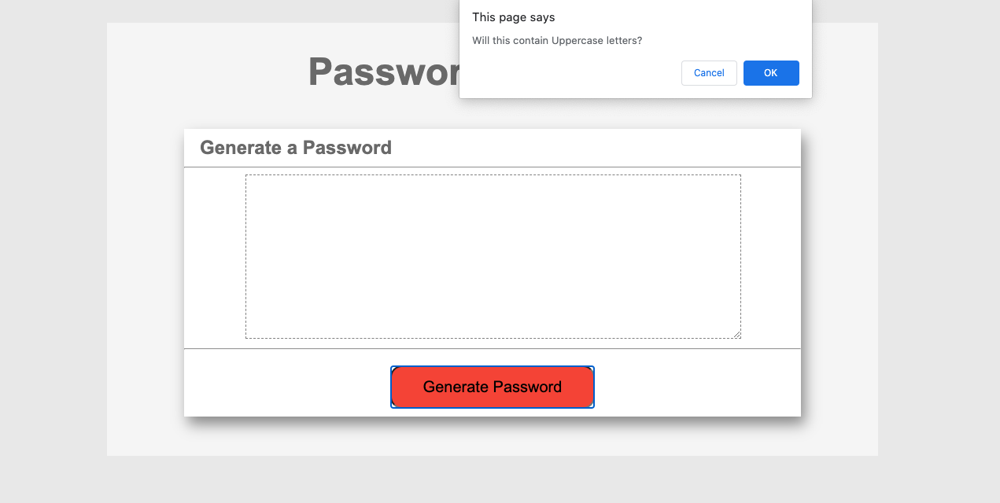
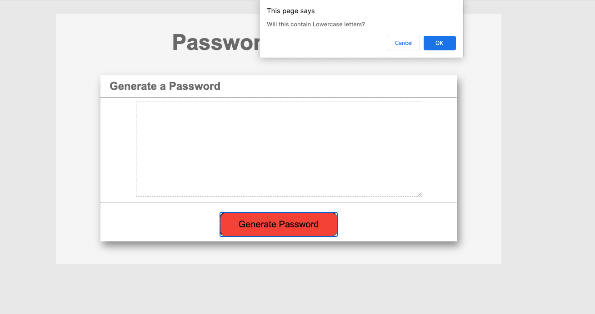
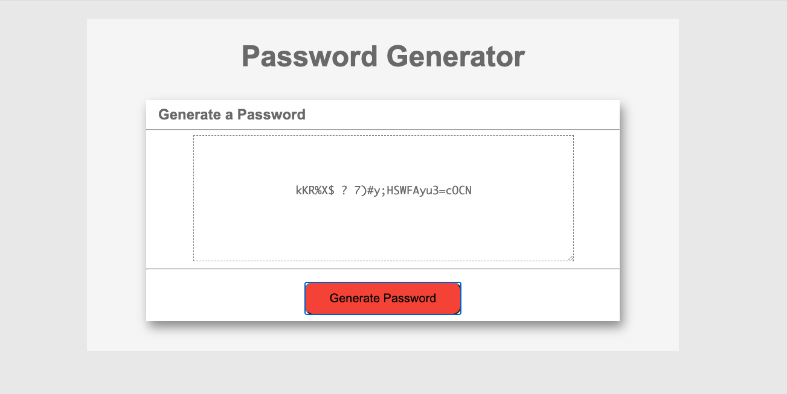

# Challenge-3-Password-Generator

### Features:

UCF Coding Bootcamp Homework 3.

To create a password generator in which the user has to provide a range of characters between 8 and 128.

The user will have to choose at least one of the given criterias: lower case, upper case, numbers & characters.

If user decides to not follow any of the given prompts the wite will instruct the user to meet the criterias.

## Links:

This project has been deployed to GitHub Pages. To get this project up and running, you can follow the deployment link. Or, download the sources files to use this as a template.

* [GitHub Repository](https://github.com/jcgom3/Challenge-3-Password-Generator)
* [Deployed GitHub IO](https://jcgom3.github.io/Challenge-3-Password-Generator)

### Summary
* HTML, CSS and Javascript documents are used to create a random password generator. 
* Man focus on this project is to use Javascript to create a user prompt.

### Project instructions with images: 
* initial prompt

* numbers prompt

* special characters prompt

* uppercase prompt

* lowercase prompt

* Generated Password

## Authors

* **Juan Carlos Gomez** 

## Acknowledgments / Special thanks 

* Tips by Lanze, Aaron & Daniel

